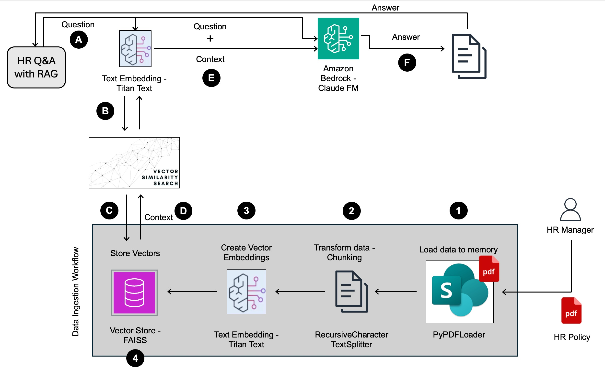
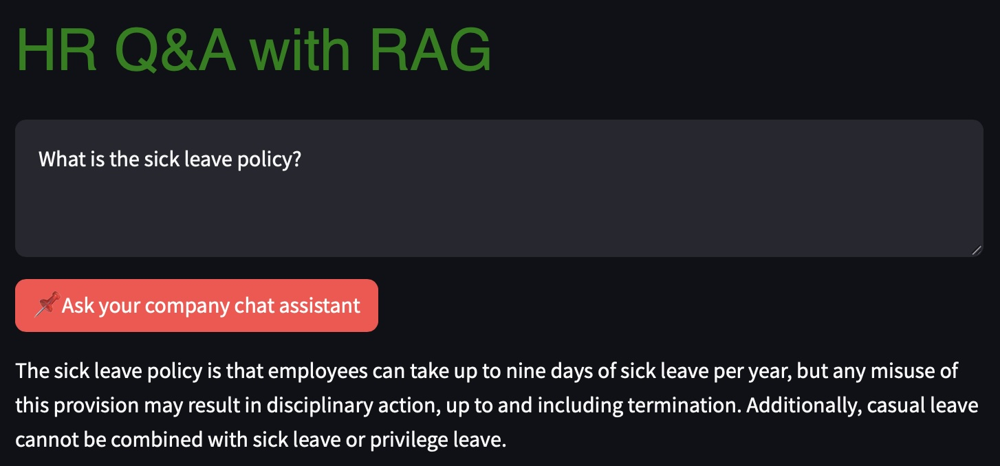

# HR Q&A Application with Retrieval-Augmented Generation (RAG)

## Overview

This project demonstrates the design and implementation of an **AI-powered HR Q&A application** using **Retrieval-Augmented Generation (RAG)**. The solution addresses the challenge of repetitive HR inquiries by automating responses to employee questions based on HR policies. By leveraging AWS GenAI capabilities, the system ensures **accurate, consistent, and timely responses** while reducing the workload on HR teams.

## Problem Statement

### Background

A client faced a growing backlog of HR tickets due to repetitive employee inquiries, overwhelming the HR team and limiting their ability to focus on strategic tasks. They needed a scalable, AI-driven solution to deliver **policy-based responses** efficiently.

### Task

- The goal was to design and implement an AI-powered HR Q&A system that:
- Automates the ingestion and retrieval of HR policies from large PDF documents.
- Minimizes AI hallucinations while ensuring high accuracy in responses.
- Improves efficiency by reducing manual HR intervention and ticket resolution times.

## Solution Design / Architecture

### Key Components

The solution leverages a Retrieval-Augmented Generation (RAG) pipeline built using:

- Amazon Titan Embeddings (Bedrock): For generating vector representations of text (such as pdf).
- OpenSearch: For vector storage and semantic search.
- LangChain: For document processing and workflow orchestration.
- OpenSearch: For vector storage and semantic search.
- Amazon Bedrock: For accessing foundation models like Claude.

### Architecture Diagram



## Components

The architecture of the application consists of the following components:

- **Data Ingestion Workflow:**
  - Loads PDF documents into memory using `PyPDFLoader` from Langchain.
  - Transforms data into chunks using `RecursiveCharacterTextSplitter` from Langchain.
  - Creates vector embeddings from chunks using Titan Text Embedding Model.
  - Stores vector embeddings in a vector store (e.g., FAISS).
  - Creates an index for easier search and retrieval.
- **User Interface:**
  - Allows users to ask questions.
- **Titan Text Embedding Model:**
  - Creates vector embeddings for user questions.
- **Vector Store:**
  - Stores vector embeddings of documents.
- **Amazon Bedrock Cloud Foundation Model:**
  - Receives user questions and context from the vector store.
  - Generates answers based on the input.

1️⃣ Data Ingestion & Processing

- **Storage:** HR policy documents were uploaded to Amazon **S3** (or SharePoint).
- **Preprocessing:**

  - Used LangChain (PyPDFLoader, RecursiveCharacterTextSplitter) to:

    - Load HR policy PDFs into memory.
    - Split long documents into smaller, manageable text chunks for efficient retrieval.

- **Vector Embedding:**

  - Leveraged **Amazon Titan Embeddings** to generate vector representations for each document chunk.

  - Stored embeddings in **OpenSearch** (or alternatives like Pinecone or FAISS) for fast semantic search.

2️⃣ Query Processing & Answer Generation
When an employee asks a question:

- FAQ Pre-Processing:

  - The query is first checked against a predefined FAQ database using OpenSearch keyword matching.

  - If a match is found, the system retrieves the answer without invoking the LLM, reducing costs.

  - FAQs are dynamically updated based on high-frequency queries from historical HR tickets.

- Fallback to AI-Powered Q&A:

  - If no relevant FAQ is found, the system generates a vector embedding of the query.

  - Performs a similarity search in the vector database to retrieve relevant HR policy context.

  - Feeds the retrieved context and the user’s question into Claude (via Amazon Bedrock) for a precise, context-aware response.

3️⃣ Optimizing Accuracy & Reducing Hallucinations

- Prompt Engineering:

  - Structured response formats to maintain consistency and clarity.

  - Tuned model parameters (temperature = 0, top-K = 1, top-P = 0.1–0.2) to ensure factual accuracy and minimize randomness.

  - Used few-shot prompting to guide the model toward reliable, consistent answers based on past queries and HR policy details.

## Data Flow

1. The user asks a question through the user interface.
2. The Titan Text Embedding Model creates a vector embedding for the question.
3. The vector embedding is used to search for similar documents in the vector store.
4. The context from the most similar document is retrieved.
5. The question and context are sent to the Amazon Bedrock Claude Foundation Model.
6. The foundation model generates an answer based on the input.
7. The answer is sent back to the user.

## Benefits of RAG

RAG offers several benefits over traditional question-answering approaches:

- **Combines retrieval and generation** to deliver accurate, context-aware answers.
- **Reduces hallucinations** by grounding responses in factual data.
- **Scales efficiently** with dynamic updates to the knowledge base.
- **Optimizes costs** by minimizing unnecessary LLM usage.
- **Improves user satisfaction** with tailored, evidence-based responses.

| **Approach**                | **Strengths**                                                                | **Weaknesses**                                                                     | **Why RAG is Better**                                                                                    |
| --------------------------- | ---------------------------------------------------------------------------- | ---------------------------------------------------------------------------------- | -------------------------------------------------------------------------------------------------------- |
| **Keyword-Based Retrieval** | - Fast and cost-effective.<br>- Simple to implement.                         | - Limited to exact keyword matches.<br>- Struggles with semantic understanding.    | RAG adds **semantic understanding** and **generative capabilities** for richer, context-aware responses. |
| **Generative Models Alone** | - Produces fluent, human-like responses.<br>- Handles complex queries well.  | - Prone to **hallucinations**.<br>- Lacks grounding in factual data.               | RAG **grounds responses in retrieved documents**, reducing hallucinations and improving accuracy.        |
| **Fine-Tuned Models**       | - Tailored to specific domains.<br>- Can produce highly relevant responses.  | - Expensive and time-consuming to train.<br>- Hard to update with new information. | RAG avoids retraining and **dynamically incorporates new documents** into the knowledge base.            |
| **Rule-Based Systems**      | - Predictable and controllable.<br>- Easy to implement for simple use cases. | - Inflexible.<br>- Requires manual updates for new policies or queries.            | RAG **automates updates** and handles a wide range of queries without manual intervention.               |

## Prerequsites:

```
pip install flask-sqlalchemy
pip install pypdf
pip install faiss-cpu
```

<!-- ## Sample Question and Response

 -->
