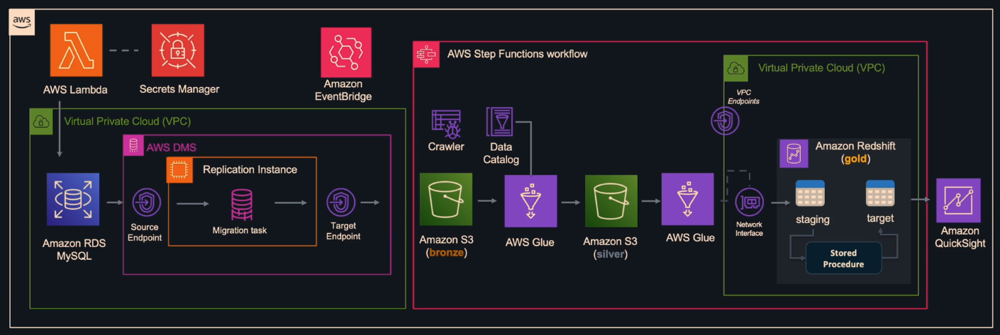

# AWS Datawarehouse Solution

## Overview

This project implements a data pipeline using the Medallion Architecture on AWS. The Medallion Architecture enables incremental improvements in data quality and structure as it moves through different processing layers: Bronze, Silver, and Gold.

This AWS-based Medallion Architecture ensures scalable, structured, and high-quality data processing. The solution provides reliable analytics capabilities for businesses looking to derive meaningful insights from their data.

## Medallion Architecture

1. **Bronze Layer**: Raw, unstructured data in its original format is ingested into an Amazon S3 bucket.
2. **Silver Layer**: Data is cleaned, filtered, and structured using AWS Glue.
3. **Gold Layer**: Aggregated, transformed data is stored in Amazon Redshift for analytics and reporting.

## AWS Data Warehouse Architecture

## AWS Components Used

### **Data Ingestion**

- **Amazon RDS (MySQL)**: Stores transactional data from the application.
- **AWS Lambda**: Generates synthetic data, simulating inserts, updates, and deletions in RDS.
- **AWS Secrets Manager**: Securely stores database credentials.
- **AWS DMS (Database Migration Service)**: Replicates data from MySQL to Amazon S3 (Bronze Layer).

### **Data Processing**

- **AWS Glue**: Extracts, transforms, and loads (ETL) data from Bronze to Silver and Silver to Gold.
- **Amazon S3**:
  - Bronze Layer: Raw data.
  - Silver Layer: Cleaned and structured data.
- **Amazon Redshift**:
  - Gold Layer: Aggregated data stored in staging tables.
  - Stored procedures merge data into target tables.

### **Orchestration and Scheduling**

- **AWS Step Functions**: Automates the entire pipeline.
- **Amazon EventBridge**: Triggers and schedules the pipeline.

### **Data Visualization**

- **Amazon QuickSight**: Creates dashboards for data analysis.

## Expected Outcomes

By implementing this architecture, we can:

- Track **sales distribution** over time.
- Analyze **total sales performance**.
- Identify **top-selling products**.
- Segment **customer data** for targeted marketing.
- Understand **revenue by brand**.

## Deployment Steps

1. **Set up an AWS Account** and configure IAM roles.
2. **Deploy Amazon RDS (MySQL)** and initialize the database.
3. **Configure AWS DMS** to migrate data from RDS to S3.
4. **Set up AWS Glue** jobs for Bronze → Silver and Silver → Gold transformation.
5. **Deploy Amazon Redshift** and create target tables.
6. **Configure AWS Step Functions** and EventBridge for orchestration.
7. **Build QuickSight dashboards** to visualize insights.

---
