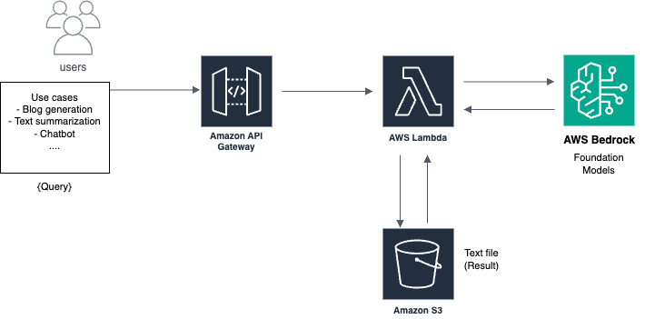

# Generative AI Project on AWS Cloud

Welcome to the Generative AI Project repository! This project demonstrates how to build an end-to-end generative AI solution on AWS using a variety of AWS services. The project supports multiple use cases such as chatbot creation, text summarization, and code generation.

## Table of Contents

- [Overview](#overview)
- [Architecture](#architecture)
- [AWS Services Used](#aws-services-used)
- [Use Cases](#use-cases)
- [Setup Instructions](#setup-instructions)
- [Features](#features)
- [Demo](#demo)
- [AWS Generative AI Implementation Guide](#aws-generative-ai-implementation-guide)
- [Future Enhancements](#future-enhancements)
- [Challenges](#challenges-and-solutions)
- [Contributing](#contributing)


---

## Overview

This project leverages AWS services to build a generative AI application that interacts with foundation models for tasks like:

- Chatbot development
- Text summarization
- Code generation

The solution provides an API-driven interface for users and supports logging, monitoring, and code storage.

---

## Architecture



The architecture includes the following components:

1. **API Gateway**: Exposes REST APIs for interacting with the application.
2. **Lambda Functions**: Processes API requests and invokes AWS Bedrock or SageMaker for generative tasks.
3. **AWS Bedrock**: Provides access to foundation models for generating responses.
4. **Amazon S3**: Stores generated outputs such as code, chat transcripts, and summarized text.
5. **CloudWatch**: Monitors logs and application health.

### Data Flow

1. **Client Request**: The client sends a request to the API Gateway.
2. **Trigger Event**: The API Gateway triggers a Lambda function.
3. **Foundation Model Invocation**: The Lambda function invokes AWS Bedrock or SageMaker to perform the generative AI task.
4. **Response Handling**: The result is stored in S3 and returned to the client.

---

## AWS Services Used

- **API Gateway**: Exposes endpoints for client interaction.
- **Lambda**: Handles serverless execution of backend logic.
- **AWS Bedrock**: Provides access to pre-trained foundation models.
- **Amazon SageMaker**: Allows deployment and customization of foundation models.
- **Amazon S3**: Stores generated outputs and application data.
- **CloudWatch**: Captures logs for debugging and monitoring.

---

## Use Cases

- **Chatbots**: Generate conversational AI responses.
- **Text Summarization**: Summarize lengthy documents or text.
- **Code Generation**: Generate code snippets for various programming tasks.

---

## Setup Instructions

1. **Prerequisites**:
   - AWS account
   - Basic knowledge of AWS services
   - Installed tools: AWS CLI, Postman, and VS Code

2. **Clone Repository**:
   ```bash
   git clone <repository-url>
   cd <repository-folder>
   ```

3. **Deploy Infrastructure**:
   - Use the AWS Management Console or AWS CLI to set up the required resources.
   - Configure API Gateway, Lambda, S3, and AWS Bedrock/SageMaker.

4. **Run the Application**:
   - Deploy the Lambda functions and API Gateway.
   - Test API endpoints using Postman or similar tools.

---

## Features

- **End-to-End Workflow**: Complete lifecycle for generative AI use cases.
- **API Gateway Integration**: Simplified interaction through APIs.
- **Serverless Architecture**: Uses AWS Lambda for scalability and efficiency.
- **Storage**: Saves outputs to Amazon S3 for easy access.
- **Monitoring**: Tracks logs and application health using CloudWatch.
- **Multi-Environment Deployment**: Supports Dev, QA, and Prod environments.

---

## Demo

### Example API Request

- **Endpoint**: `https://<api-gateway-url>/dev/code-generation`
- **Payload**:
  ```json
  {
    "prompt": "Write a Python code to implement binary search",
    "language": "Python"
  }
  ```
- **Response**:
  ```json
  {
    "status": 200,
    "message": "Code generation completed",
    "code": "def binary_search(arr, x): ..."
  }
  ```

---
## AWS Generative AI Implementation Guide
A comprehensive guide to implement generative AI solutions using AWS services including Bedrock, Lambda, API Gateway, and S3.
Table of Contents


### Prerequisites

- AWS Account with appropriate permissions
- Python 3.12
- AWS CLI installed and configured
- Basic understanding of AWS services
- Postman or similar API testing tool

### Architecture
The solution uses the following AWS services:

- AWS Bedrock for foundation models
- AWS Lambda for serverless compute
- Amazon API Gateway for REST API
- Amazon S3 for storage
- IAM for permissions
- CloudWatch for logging

### Setup Instructions
1. AWS Bedrock Access

1) Log into AWS Console
2) Navigate to AWS Bedrock
3) Select region (recommended: us-east-1)
4) Configure model access:

  - Navigate to 'Manage model access'
  - Select desired foundation models
  - Submit access requests
  - Wait for approval


2. Lambda Function Setup

1) Create Lambda Function:
  - Navigate to Lambda
  - Click "Create function"
  - Select "Author from scratch"
  - Runtime: Python 3.12

2) Create Boto3 Layer:
```bash
mkdir python
pip install boto3 -t python/
zip -r boto3_layer.zip python/
```

3) Upload Layer:
  - In Lambda, create new layer
  - Upload boto3_layer.zip
  - Select Python runtimes (3.10, 3.11, 3.12)
  - Add layer to function


3. Lambda Function Code
```python
import boto3
import json
import datetime
from botocore.config import Config

def generate_blog(blog_topic: str) -> str:
    try:
        bedrock = boto3.client(
            'bedrock-runtime',
            region_name='us-east-1',
            config=Config(
                read_timeout=300,
                retries={'max_attempts': 3}
            )
        )
        
        prompt = f"""<inst>Human: Write a 200 words blog on the topic {blog_topic}</inst>
        Assistant:"""
        
        body = {
            "prompt": prompt,
            "max_gen_length": 512,
            "temperature": 0.7,
            "top_p": 0.9
        }
        
        response = bedrock.invoke_model(
            body=json.dumps(body),
            modelId="meta.llama2-13b-chat-v1"
        )
        
        response_content = json.loads(response.get('body').read())
        blog_details = response_content['generation']
        return blog_details
        
    except Exception as e:
        print(f"Error generating blog: {str(e)}")
        return ""

def lambda_handler(event, context):
    try:
        body = json.loads(event['body'])
        blog_topic = body.get('blog_topic', '')
        
        generated_blog = generate_blog(blog_topic)
        
        if generated_blog:
            current_time = datetime.datetime.now().strftime("%H%M%S")
            s3_key = f"blog_output/{current_time}.txt"
            s3_bucket = "aws-bedrock-course-1"
            
            save_blog_details(s3_key, s3_bucket, generated_blog)
            
        return {
            'statusCode': 200,
            'body': json.dumps('Blog generation completed')
        }
        
    except Exception as e:
        return {
            'statusCode': 500,
            'body': json.dumps(f'Error: {str(e)}')
        }
```

4. S3 Bucket Setup

1) Create bucket:
  - Navigate to S3
  - Create bucket with unique name
  - Note the bucket name for Lambda code


5. API Gateway Setup

1) Create API:
  - Navigate to API Gateway
  - Create HTTP API
  - Setup POST route (/blog-generation)
  - Integrate with Lambda function

2) Deploy API:
  - Create 'dev' stage
  - Deploy API
  - Note the endpoint URL


6. IAM Permissions
Required permissions for Lambda execution role:
```json
{
    "Version": "2012-10-17",
    "Statement": [
        {
            "Effect": "Allow",
            "Action": [
                "bedrock:InvokeModel",
                "s3:PutObject",
                "logs:CreateLogGroup",
                "logs:CreateLogStream",
                "logs:PutLogEvents"
            ],
            "Resource": "*"
        }
    ]
}
```

### Testing

1) Using Postman:
```json
POST /blog-generation
{
    "blog_topic": "machine learning and generative AI"
}
```

2) Expected Response:
```json
{
    "statusCode": 200,
    "body": "Blog generation completed"
}
```

3) Verify:

  - Check S3 bucket for output file
  - Review CloudWatch logs
  - Validate blog content


### Troubleshooting
Common issues and solutions:

1) Model Access Error:

  - Verify Bedrock model access
  - Check IAM permissions


2) Lambda Timeout:

  - Increase timeout in configuration
  - Optimize code if necessary


3) API Gateway Issues:

  - Verify deployment stage
  - Check integration settings
  - Validate endpoint URL


4) S3 Access Error:

  - Verify bucket name
  - Check IAM permissions
  - Validate bucket region

---
## Challenges and Solutions

### Lambda Challenges
1. **Cold Start Latency**  
   - **Challenge**: High latency during the initialization of Lambda functions.  
   - **Solution**: Enabled provisioned concurrency for critical functions and utilized warm-up strategies to minimize delays.

2. **Timeout Limitation**  
   - **Challenge**: Lambda functions are limited to 15-minute execution time.  
   - **Solution**: Adopted asynchronous processing using SQS and integrated Step Functions for orchestrating long-running tasks.

3. **Memory Constraints**  
   - **Challenge**: Limited memory capacity (10GB max).  
   - **Solution**: Optimized memory utilization through efficient dependency management and resource cleanup.

### Foundation Model Challenges
1. **Variable Response Times**  
   - **Challenge**: Foundation models exhibited inconsistent response times.  
   - **Solution**: Implemented retry mechanisms with exponential backoff to handle delays effectively.

2. **Token Limitations**  
   - **Challenge**: Models had constraints on input/output token sizes.  
   - **Solution**: Managed token limits by splitting large inputs into smaller chunks and ensuring seamless processing.

### API Gateway Challenges
1. **Hard Timeout**  
   - **Challenge**: API Gateway imposes a 29-second timeout for requests.  
   - **Solution**: Shifted to asynchronous processing with status checks to ensure timely responses.

2. **Request/Response Size Limits**  
   - **Challenge**: API Gateway has a 10MB payload limit.  
   - **Solution**: Utilized S3 for handling large payloads and implemented chunked uploads for seamless data transfer.

### Scaling Challenges
1. **Concurrent Request Management**  
   - **Challenge**: Handling high volumes of concurrent requests efficiently.  
   - **Solution**: Implemented rate-limiting strategies and leveraged queuing systems like SQS to manage traffic bursts.

---


## Future Enhancements

- Add fine-tuning capabilities for foundation models.
- Explore additional use cases like document translation and image generation.
- Enhance user interface for seamless client interaction.

## Contributing

Feel free to submit issues and enhancement requests.

---