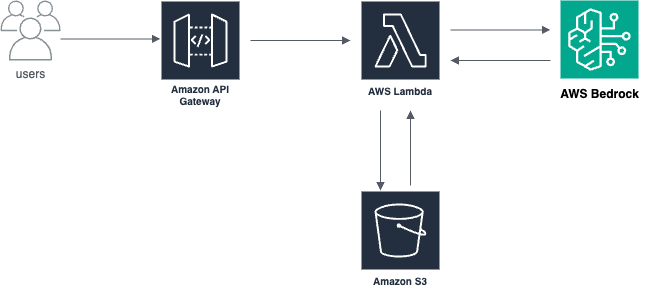

# Generative AI Project on AWS Cloud

Welcome to the Generative AI Project repository! This project demonstrates how to build an end-to-end generative AI solution on AWS using a variety of AWS services. The project supports multiple use cases such as chatbot creation, text summarization, and code generation.

## Table of Contents

- [Overview](#overview)
- [Architecture](#architecture)
- [AWS Services Used](#aws-services-used)
- [Use Cases](#use-cases)
- [Setup Instructions](#setup-instructions)
- [Features](#features)
- [Demo](#demo)
- [Future Enhancements](#future-enhancements)
- [Contributing](#contributing)
- [License](#license)

---

## Overview

This project leverages AWS services to build a generative AI application that interacts with foundation models for tasks like:

- Chatbot development
- Text summarization
- Code generation

The solution provides an API-driven interface for users and supports logging, monitoring, and code storage.

---

## Architecture



The architecture includes the following components:

1. **API Gateway**: Exposes REST APIs for interacting with the application.
2. **Lambda Functions**: Processes API requests and invokes AWS Bedrock or SageMaker for generative tasks.
3. **AWS Bedrock**: Provides access to foundation models for generating responses.
4. **Amazon S3**: Stores generated outputs such as code, chat transcripts, and summarized text.
5. **CloudWatch**: Monitors logs and application health.

### Data Flow

1. **Client Request**: The client sends a request to the API Gateway.
2. **Trigger Event**: The API Gateway triggers a Lambda function.
3. **Foundation Model Invocation**: The Lambda function invokes AWS Bedrock or SageMaker to perform the generative AI task.
4. **Response Handling**: The result is stored in S3 and returned to the client.

---

## AWS Services Used

- **API Gateway**: Exposes endpoints for client interaction.
- **Lambda**: Handles serverless execution of backend logic.
- **AWS Bedrock**: Provides access to pre-trained foundation models.
- **Amazon SageMaker**: Allows deployment and customization of foundation models.
- **Amazon S3**: Stores generated outputs and application data.
- **CloudWatch**: Captures logs for debugging and monitoring.

---

## Use Cases

- **Chatbots**: Generate conversational AI responses.
- **Text Summarization**: Summarize lengthy documents or text.
- **Code Generation**: Generate code snippets for various programming tasks.

---

## Setup Instructions

1. **Prerequisites**:
   - AWS account
   - Basic knowledge of AWS services
   - Installed tools: AWS CLI, Postman, and VS Code

2. **Clone Repository**:
   ```bash
   git clone <repository-url>
   cd <repository-folder>
   ```

3. **Deploy Infrastructure**:
   - Use the AWS Management Console or AWS CLI to set up the required resources.
   - Configure API Gateway, Lambda, S3, and AWS Bedrock/SageMaker.

4. **Run the Application**:
   - Deploy the Lambda functions and API Gateway.
   - Test API endpoints using Postman or similar tools.

---

## Features

- **End-to-End Workflow**: Complete lifecycle for generative AI use cases.
- **API Gateway Integration**: Simplified interaction through APIs.
- **Serverless Architecture**: Uses AWS Lambda for scalability and efficiency.
- **Storage**: Saves outputs to Amazon S3 for easy access.
- **Monitoring**: Tracks logs and application health using CloudWatch.
- **Multi-Environment Deployment**: Supports Dev, QA, and Prod environments.

---

## Demo

### Example API Request

- **Endpoint**: `https://<api-gateway-url>/dev/code-generation`
- **Payload**:
  ```json
  {
    "prompt": "Write a Python code to implement binary search",
    "language": "Python"
  }
  ```
- **Response**:
  ```json
  {
    "status": 200,
    "message": "Code generation completed",
    "code": "def binary_search(arr, x): ..."
  }
  ```

---

## Future Enhancements

- Add fine-tuning capabilities for foundation models.
- Explore additional use cases like document translation and image generation.
- Enhance user interface for seamless client interaction.

---

## Contributing

Contributions are welcome! Please fork this repository and submit a pull request with your changes.

---

## License

This project is licensed under the MIT License. See the LICENSE file for details.